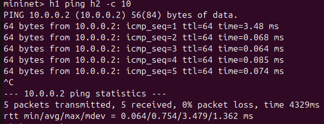
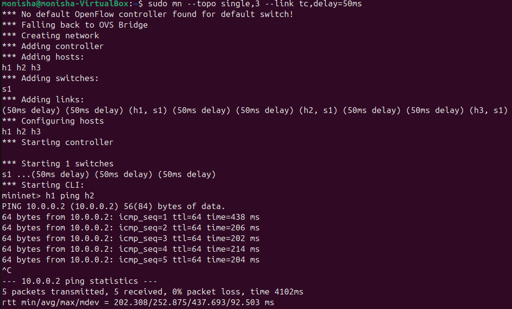
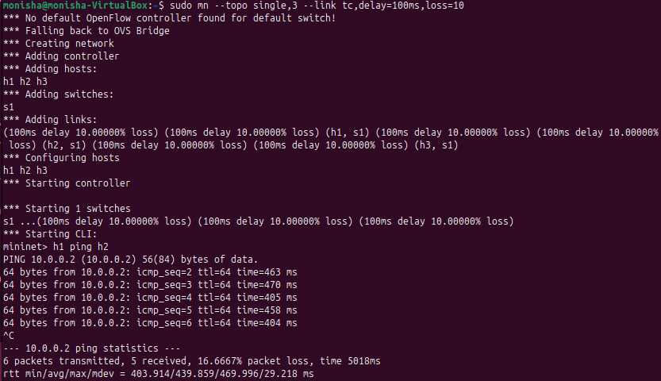

# Network Delay Measurement Tool

## 📌 Project Title

Network Delay Measurement Tool

---

## 📖 Problem Statement

Measure and analyze latency (Round Trip Time - RTT) between hosts in a network. Record RTT values using ping, compare across different scenarios, and analyze delay variations.

---

## 🎯 Objectives

* Measure RTT using ICMP ping
* Analyze impact of delay and packet loss
* Compare allowed vs blocked communication
* Demonstrate SDN concepts using POX controller
* Observe and analyze flow table entries

---

## ⚙️ Tools and Technologies

* Mininet (Network Emulator)
* POX Controller (SDN Controller)
* Ubuntu (Virtual Machine)
* Python (Automation Script)
* ICMP Ping

---

## 🏗️ Network Topology

Single switch topology with 3 hosts:

h1 ---- s1 ---- h2
│
h3

---

## ▶️ Setup Instructions

### 1. Clean previous setup

sudo mn -c

### 2. Start POX Controller

cd pox
./pox.py forwarding.l2_learning

### 3. Start Mininet

sudo mn --topo single,3 --controller=remote

---

## 🧪 Experimental Scenarios

### ✅ 1. Allowed Communication

h1 ping h2 -c 5

---

### ❌ 2. Blocked Communication

sh ovs-ofctl add-flow s1 "priority=100,icmp,actions=drop"

h1 ping h2 -c 5

---

### 🌐 3. Normal Network

sudo mn --topo single,3

h1 ping h2 -c 5

---

### ⏱️ 4. 50ms Delay

sudo mn --topo single,3 --link tc,delay=50ms

h1 ping h2 -c 5

---

### ⚠️ 5. 100ms Delay + Packet Loss

sudo mn --topo single,3 --link tc,delay=100ms,loss=10

h1 ping h2 -c 5

---

## 📊 Flow Table Verification

To view flow rules:
sh ovs-ofctl dump-flows s1

This shows match-action rules installed by the controller and manual rules (e.g., drop rule).

---

## 💻 Python Automation Script

File: `delay_measure.py`

This script automates RTT extraction from ping output.

### Run:

sudo cp delay_measure.py /tmp/
sudo mn --topo single,3

mininet> h1 python3 /tmp/delay_measure.py

---

## 📊 Experimental Results

| Scenario           | Min RTT (ms) | Avg RTT (ms) | Max RTT (ms) | Packet Loss |
| ------------------ | ------------ | ------------ | ------------ | ----------- |
| Normal Network     | ~0.06        | ~0.75        | ~3.48        | 0%          |
| 50ms Delay         | ~202         | ~253         | ~438         | 0%          |
| 100ms Delay + Loss | ~404         | ~440         | ~470         | ~16.7%      |
| Allowed (SDN)      | ~0.07        | ~8.7         | ~42          | 0%          |
| Blocked            | -            | -            | -            | 100%        |

---

## 📈 Analysis

* RTT increases significantly with added delay
* Delay affects both forward and return paths, increasing total RTT
* Packet loss introduces instability and increases effective delay
* In SDN, the first packet is slower due to controller interaction
* Flow rules improve performance for subsequent packets
* Blocking rules successfully drop ICMP packets, preventing communication

---

## 📸 Screenshots

### Allowed Communication

### Blocked Communication

### Flow Table (Allowed)

### Flow Table (Blocked)

### Normal Network

### 50ms Delay

### 100ms Delay + Loss

### Python Script Output

---

## ✅ Conclusion

This project demonstrates how network latency varies under different conditions such as delay and packet loss. The SDN controller introduces initial overhead but improves efficiency through flow rule installation. Blocking rules effectively restrict communication, showcasing network control capabilities.

---

## 📚 References

* https://mininet.org
* POX Controller Documentation
* Course Materials
