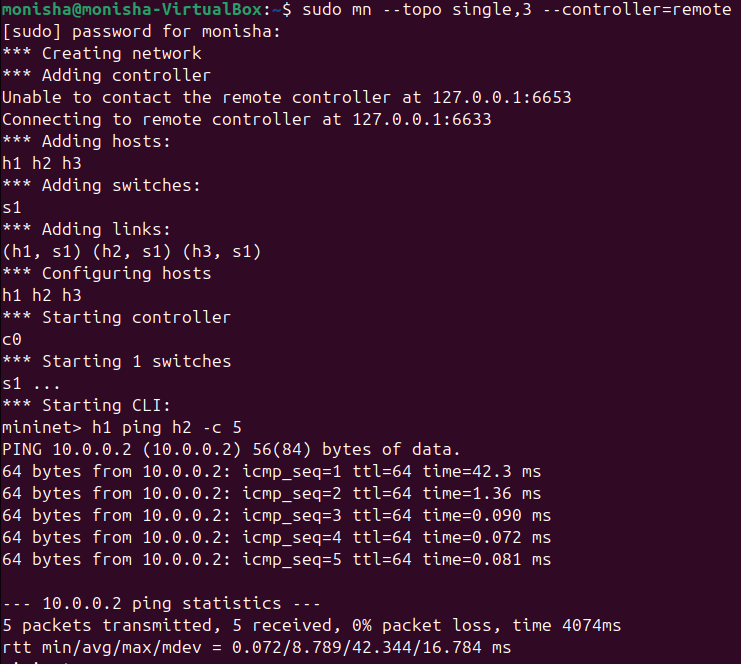

# Network Delay Measurement Tool

## 📌 Problem Statement

Measure and analyze latency (RTT) between hosts using Mininet. Record RTT values, compare across different network conditions, and analyze delay variations.

---

## ⚙️ Setup

### Install Mininet

sudo apt update
sudo apt install mininet -y

### Run POX Controller

cd pox
./pox.py forwarding.l2_learning

---

## ▶️ Execution

### Start Mininet (example)

sudo mn --topo single,3

### Test connectivity

h1 ping h2 -c 5

---

## 🧪 Test Scenarios

### 1. Normal Network

sudo mn --topo single,3

### 2. With Delay (50ms)

sudo mn --topo single,3 --link tc,delay=50ms

### 3. Delay + Packet Loss

sudo mn --topo single,3 --link tc,delay=100ms,loss=10

### 4. With SDN Controller (POX)

sudo mn --topo single,3 --controller=remote

---

## 📊 Experimental Results

| Scenario              | Min RTT (ms) | Avg RTT (ms) | Max RTT (ms) | Packet Loss |
| --------------------- | ------------ | ------------ | ------------ | ----------- |
| Normal Network        | 0.064        | 0.754        | 3.479        | 0%          |
| 50ms Delay            | 202.308      | 252.875      | 437.693      | 0%          |
| 100ms Delay + Loss    | 403.914      | 439.859      | 469.996      | ~16.7%      |
| With Controller (POX) | 0.072        | 8.789        | 42.344       | 0%          |

---

## 📈 Analysis

* RTT increases significantly with added network delay.
* Observed RTT is higher than configured delay due to bidirectional transmission and multiple links.
* Packet loss introduces variability and increases effective delay.
* With POX, the first packet experiences higher delay due to flow rule installation.
* Subsequent packets are faster due to direct forwarding by the switch.

---

## 📸 Screenshots

### Normal Network

### 50ms Delay

### 100ms Delay + Loss

### With Controller (POX)

---

## ✅ Conclusion

The project demonstrates how latency is affected by delay and packet loss. The SDN controller introduces initial overhead but improves efficiency for subsequent packets.

---

## 📚 References

* https://mininet.org
* POX Controller Documentation
