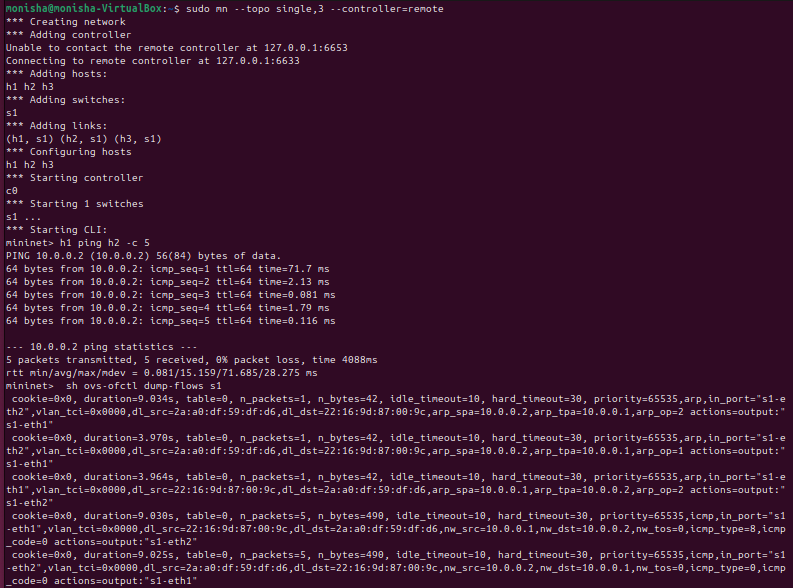
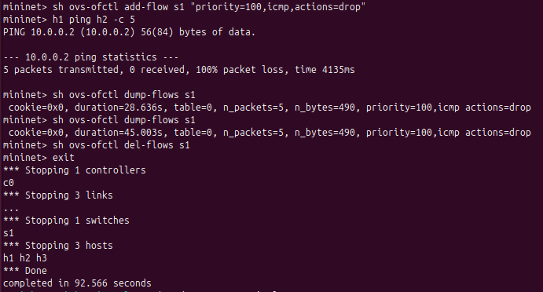
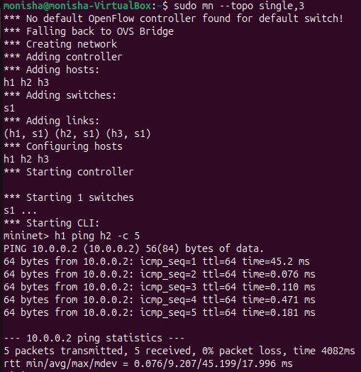
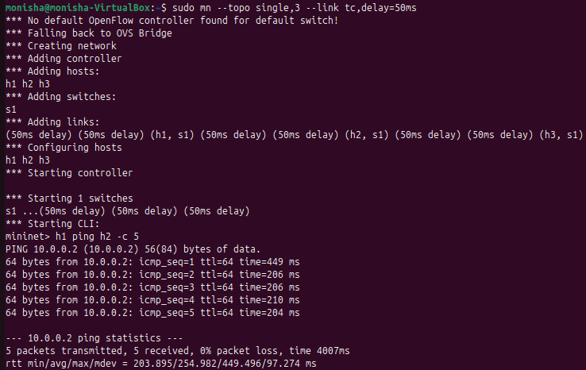
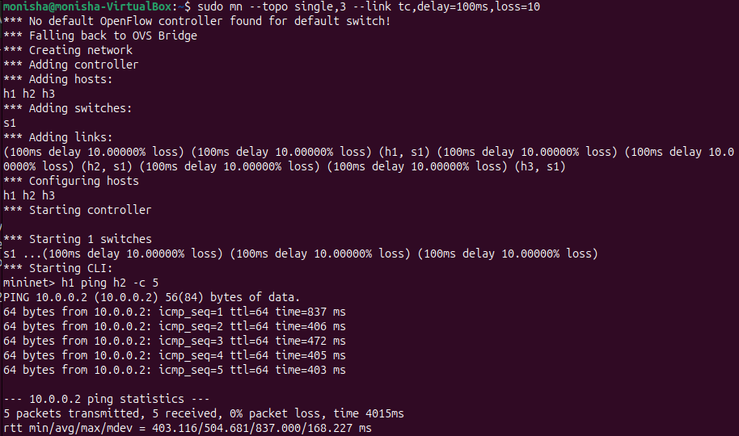
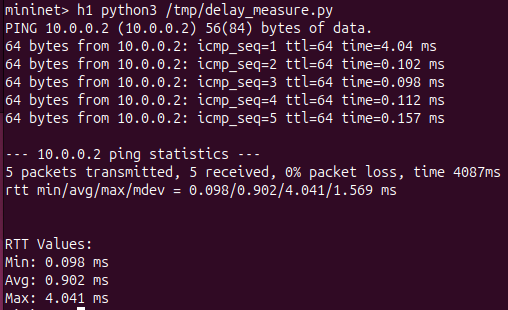

Network Delay Measurement Tool
📌 Problem Statement

Measure and analyze latency (RTT) between hosts using Mininet. Record RTT values, compare across scenarios, and analyze delay variations.

🎯 Objectives
Measure RTT using ICMP ping
Analyze the impact of delay and packet loss
Compare allowed vs blocked communication
Demonstrate SDN using POX controller
Observe flow table behavior
⚙️ Setup
Start POX Controller
cd pox
./pox.py forwarding.l2_learning
Start Mininet
sudo mn --topo single,3 --controller=remote
🧪 Experimental Scenarios
✅ Allowed Communication (SDN)
h1 ping h2 -c 5

RTT:

Min: 0.081 ms
Avg: 15.159 ms
Max: 71.685 ms
Packet Loss: 0%
❌ Blocked Communication
sh ovs-ofctl add-flow s1 "priority=100,icmp,actions=drop"
h1 ping h2 -c 5

Result:

Packet Loss: 100%
🌐 Normal Network (No Controller)
sudo mn --topo single,3
h1 ping h2 -c 5

RTT:

Min: 0.076 ms
Avg: 9.207 ms
Max: 45.199 ms
Packet Loss: 0%
⏱️ 50ms Delay
sudo mn --topo single,3 --link tc,delay=50ms
h1 ping h2 -c 5

RTT:

Min: 203.895 ms
Avg: 254.982 ms
Max: 449.496 ms
Packet Loss: 0%
⚠️ 100ms Delay + Loss
sudo mn --topo single,3 --link tc,delay=100ms,loss=10
h1 ping h2 -c 5

RTT:

Min: 403.116 ms
Avg: 504.681 ms
Max: 837.000 ms
Packet Loss: 0% (observed)
📊 Flow Table

Command:

sh ovs-ofctl dump-flows s1

Observations:

ICMP flow rules are installed for forwarding
Drop rule successfully blocks traffic in blocked scenario
Flow table reflects match–action logic of SDN
💻 Python Script (delay_measure.py)

This script automates RTT extraction from ping output.

import subprocess
import re

def measure_rtt():
    result = subprocess.run(
        ["ping", "-c", "5", "10.0.0.2"],
        capture_output=True,
        text=True
    )

    output = result.stdout
    print(output)

    match = re.search(r"rtt min/avg/max/mdev = (.*) ms", output)
    if match:
        values = match.group(1).split("/")
        print("\nRTT Values:")
        print(f"Min: {values[0]} ms")
        print(f"Avg: {values[1]} ms")
        print(f"Max: {values[2]} ms")

measure_rtt()
▶️ How to Run
sudo cp delay_measure.py /tmp/
sudo mn --topo single,3
mininet> h1 python3 /tmp/delay_measure.py
Output:
Min: 0.098 ms
Avg: 0.902 ms
Max: 4.041 ms

---

## 📊 Summary Table

| Scenario           | Min RTT | Avg RTT | Max RTT | Packet Loss |
| ------------------ | ------- | ------- | ------- | ----------- |
| Allowed (SDN)      | 0.081   | 15.159  | 71.685  | 0%          |
| Blocked            | -       | -       | -       | 100%        |
| Normal             | 0.076   | 9.207   | 45.199  | 0%          |
| 50ms Delay         | 203.895 | 254.982 | 449.496 | 0%          |
| 100ms Delay + Loss | 403.116 | 504.681 | 837.000 | 0%          |

---

## 📈 Analysis

* RTT increases significantly with delay
* Delay is applied on both directions, increasing total RTT
* Packet loss introduces variability (though not observed due to small sample size)
* SDN controller adds initial delay due to flow setup
* Flow rules optimize subsequent packet forwarding
* Blocking rule successfully drops all ICMP packets

---

## 📸 Screenshots

### ✅ Allowed Communication (SDN)
  
*Figure 1: Successful communication between hosts using SDN controller. Initial delay is observed due to flow rule installation.*

---

### ❌ Blocked Communication
  
*Figure 2: Communication blocked using OpenFlow rule. All ICMP packets are dropped, resulting in 100% packet loss.*

---

### 🌐 Normal Network
  
*Figure 3: RTT in normal network without delay. Very low latency observed.*

---

### ⏱️ 50ms Delay
  
*Figure 4: Increased RTT due to added 50ms delay. Delay affects both forward and return paths.*

---

### ⚠️ 100ms Delay + Packet Loss
  
*Figure 5: High RTT due to 100ms delay. Packet loss may not always be observed due to randomness.*

---

### 💻 Python Script Output
  
*Figure 6: Automated extraction of RTT values using the Python script.*

---

## ✅ Conclusion

The project demonstrates how latency varies under different network conditions. SDN introduces initial overhead but improves efficiency. Flow rules enable control over network behavior, including blocking traffic.

---
